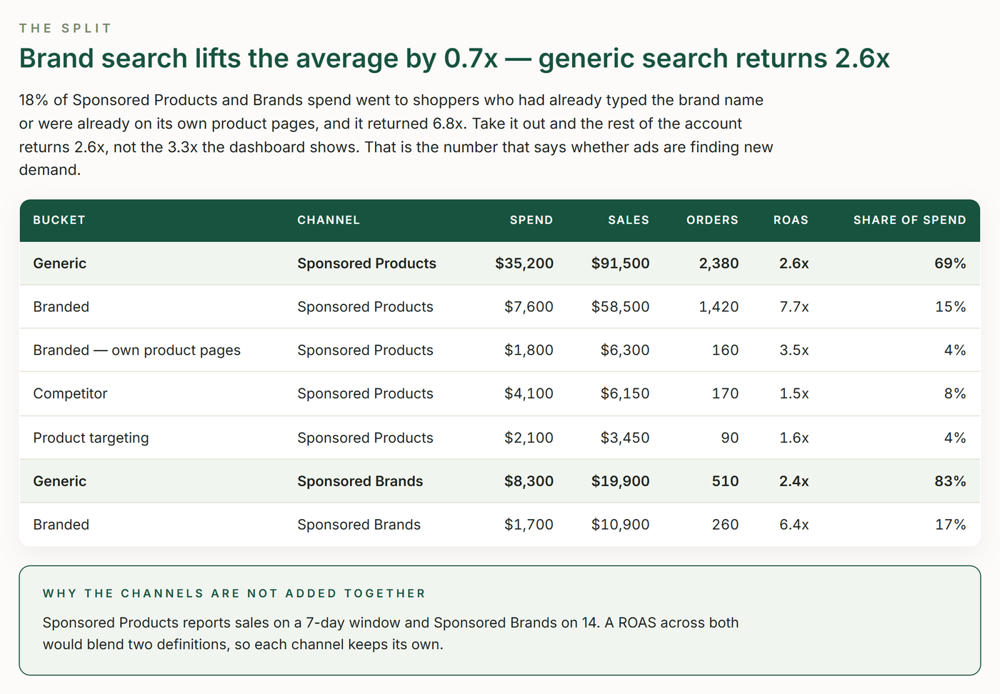

# TrackIQ: Amazon Branded vs. Non-Branded Search

Takes the blended ACOS everyone reports and splits it into its honest parts: brand, competitor, product targeting and generic. Brand search almost always flatters the average, so the number that says whether advertising is growing the business is the generic one.

Run it monthly, and before any conversation about "our ACOS is fine".

Part of **Amazon Sponsored Ads** in the
[TrackIQ skills catalog](https://github.com/TrackIQ-HQ/amazon-seller-skills).

Built as an [Agent Skill](https://code.claude.com/docs/en/skills). Runs in
Claude Code, Claude web, Claude desktop and ChatGPT from the same folder.

---

## Powered by the TrackIQ MCP

[](https://trackiq.com/mcp)

This skill reads your live Amazon account through the
**[TrackIQ MCP](https://trackiq.com/mcp)** — 16 tools connecting your AI
assistant to Amazon data:

Sales & Traffic · Orders · Inventory · Returns · Sponsored Products · Sponsored
Brands · Sponsored Display · Amazon DSP · AMC Cloud · Keywords · Search Terms ·
Targeting · Search Query Performance · Organic Rank · Best Seller Rank · Buy Box
History · Brand Analytics · Export

Works with Claude, ChatGPT and Cursor. **[Get access →](https://trackiq.com/mcp)**

---

## What you get



Splits every Amazon Sponsored Products and Sponsored Brands search term into branded, competitor, product-targeting and generic buckets, then shows where the ad money really goes — how much is spent on shoppers who already typed the brand, what generic search returns once brand is taken out, whether competitor conquesting pays — and checks the brand's purchase share on its own name before calling brand spend defence or waste. Use when the user asks about branded vs non-branded, brand vs generic spend, branded search, brand defence, conquesting, competitor keywords, true or non-branded ACOS, or whether ACOS is flattered by brand terms.

### The rules that keep it honest

- **Pull Sponsored Products and Sponsored Brands separately**
- **Show the classifier**
- **Never call brand spend waste on ROAS alone**
- **The headline is generic ROAS, not blended**

The full list is in `SKILL.md`, and each one exists because getting it wrong
produces a confident, wrong answer rather than an obvious error.

## Requirements

- The TrackIQ MCP, for `list_marketplaces`, `get_search_terms`, `get_targets` and `get_search_query_performance`. - **The brand's own terms**, from the Brand terms block in account.md — the brand name, its misspellings and its product-line names. Ask once. - **Competitor brand names**, from the same block. Optional; without them competitor search counts as generic, and the report says so. - **Without the MCP:** works from a search-term report exported from Campaign Manager for Sponsored Products and Sponsored Brands.

---

## Install

### Claude Code

```
/plugin marketplace add TrackIQ-HQ/amazon-seller-skills
/plugin install trackiq-amazon-branded-search@trackiq
```

### Claude web, desktop, mobile

1. Download the `.zip` from the
   [latest release](https://github.com/TrackIQ-HQ/trackiq-amazon-branded-search/releases)
2. **Settings → Capabilities → Skills** (code execution must be on)
3. **Create skill → Upload a skill**, choose the `.zip`
4. Toggle it on

### ChatGPT

Same zip. **Plugins → Skills → Create → Upload from your computer.**

---

## Setup

Answers live in `account.md`, copied from
[`assets/account.example.md`](skills/trackiq-amazon-branded-search/assets/account.example.md).
**Every TrackIQ skill reads the same file**, so an account already set up for
another TrackIQ report needs nothing added.

## Delivery

Asked once and stored in `account.md`: **in-chat** (default), **file**,
**Slack**, **n8n** or **email**. Anything leaving the chat confirms with you
first and falls back to in-chat, with a note.

---

## Customizing

| File | What it controls |
|---|---|
| `checks.md` | the pre-send checks |
| `method.md` | the method and every threshold |
| `pulls.md` | the call sequence and its traps |
| `report-template.html` | the report shell |

---

## Contributing

```bash
python scripts/validate.py    # must exit 0 before any commit
python scripts/build.py       # writes dist/ zip + registry.json
```

Read [AUTHORING.md](https://github.com/TrackIQ-HQ/amazon-seller-skills/blob/main/AUTHORING.md)
before proposing changes.

## License

MIT. See [LICENSE](LICENSE).
